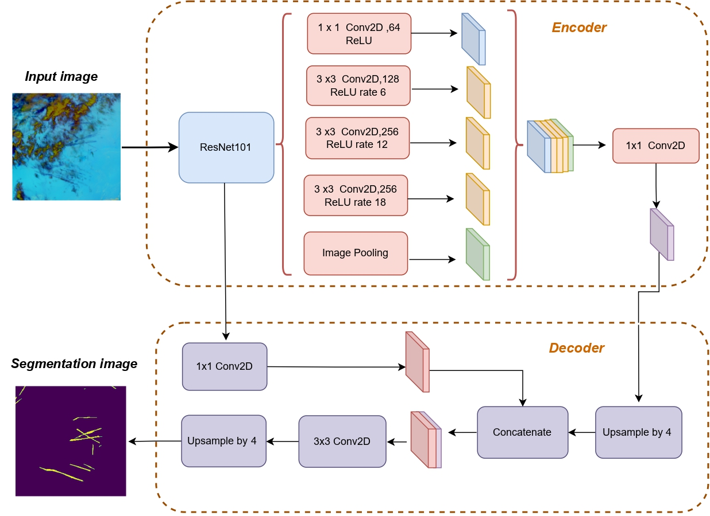

## SegX-Net-Contrail-Detection
**Bangladesh University of Business and Technology**

S. M. Nuruzzaman Nobel, ***Md. Ashraful Hossain**, Md. Mohsin Kabir, M. F. Mridha, Sultan Alfarhood, Mejdl Safran

[[`Paper`](https://journals.plos.org/plosone/article?id=10.1371/journal.pone.0298160)] [[`Dataset`](https://www.kaggle.com/competitions/google-research-identify-contrails-reduce-global-warming)]
[[`Demo`]()] 
[[`BibTeX`]()]


Details are being prepared and will soon be updated here -
<br><br><br>


## 1. Abstract

Contrails are line-shaped clouds formed in the exhaust of aircraft engines that significantly contribute to global warming. This paper confidently proposes integrating advanced image segmentation techniques to identify and monitor aircraft contrails to address the challenges associated with climate change. We propose the SegX-Net architecture, a highly efficient and lightweight model that combines the DeepLabV3+, upgraded, and ResNet-101 architectures to achieve superior segmentation accuracy. We evaluated the performance of our model on comprehensive dataset from Google research and rigorously measured its efficacy with metrics such as IoU, F1 score, Sensitivity and Dice Coefficient. Our results demonstrate that our enhancements have significantly improved the efficacy of the SegX-Net model, with an outstanding IoU score of 98.86% and an impressive F1 score of 99.47%. These results unequivocally demonstrate the potential of image segmentation methods to effectively address and mitigate the impact of air conflict on global warming. Using our proposed SegX-Net architecture, stakeholders in the aviation industry can confidently monitor and mitigate the impact of aircraft shrinkage on the environment, significantly contributing to the global fight against climate change.

## 2. Proposed Architecture:



## 3. Dataset:

Dataset can be access via this link : https://www.kaggle.com/competitions/google-research-identify-contrails-reduce-global-warming/overview
<br><br><br><br>
# 4. Citation

```bibtex
@article{10.1371/journal.pone.0298160,
    doi = {10.1371/journal.pone.0298160},
    author = {Nobel, S. M. Nuruzzaman AND Hossain, Md. Ashraful AND Kabir, Md. Mohsin AND Mridha, M. F. AND Alfarhood, Sultan AND Safran, Mejdl},
    journal = {PLOS ONE},
    publisher = {Public Library of Science},
    title = {SegX-Net: A novel image segmentation approach for contrail detection using deep learning},
    year = {2024},
    month = {03},
    volume = {19},
    url = {https://doi.org/10.1371/journal.pone.0298160},
    pages = {1-23},
    abstract = {Contrails are line-shaped clouds formed in the exhaust of aircraft engines that significantly contribute to global warming. This paper confidently proposes integrating advanced image segmentation techniques to identify and monitor aircraft contrails to address the challenges associated with climate change. We propose the SegX-Net architecture, a highly efficient and lightweight model that combines the DeepLabV3+, upgraded, and ResNet-101 architectures to achieve superior segmentation accuracy. We evaluated the performance of our model on a comprehensive dataset from Google research and rigorously measured its efficacy with metrics such as IoU, F1 score, Sensitivity and Dice Coefficient. Our results demonstrate that our enhancements have significantly improved the efficacy of the SegX-Net model, with an outstanding IoU score of 98.86% and an impressive F1 score of 99.47%. These results unequivocally demonstrate the potential of image segmentation methods to effectively address and mitigate the impact of air conflict on global warming. Using our proposed SegX-Net architecture, stakeholders in the aviation industry can confidently monitor and mitigate the impact of aircraft shrinkage on the environment, significantly contributing to the global fight against climate change.},
    number = {3},

}
```


## License

This work is for research purposes and non-commercial use only. See [Attribution-NonCommercial 4.0 International (CC BY-NC 4.0)](https://creativecommons.org/licenses/by-nc/4.0/)

